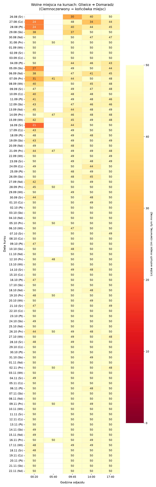
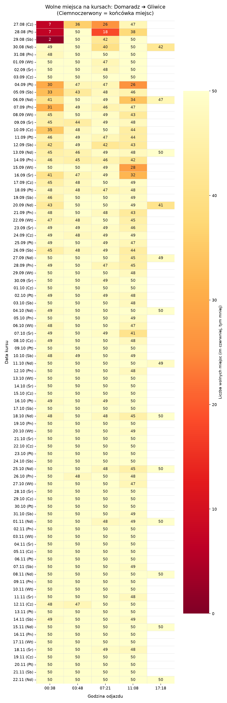

# 🚌 Neobus Sentinel & Obserwatorium Podróży

> 🕒 **Ostatnia aktualizacja:** `28.08.2026 07:16:47`  
> 🟢 **Dużo miejsc (26–50)** | 🟡 **Średnie obłożenie (6–25)** | 🔴 **Ostatnie miejsca (1–5)**

## 📍 Twoje obserwowane wyjazdy (Gliwice ➔ Domaradz)

| Data | Godzina odjazdu | Wolne miejsca | Cena | Zakup |
| :--- | :--- | :--- | :--- | :---: |
| 📅 **11.09.2026** | ⏰ 00:20 -> 05:24 | 🟢 `[████████░░] 41/50` | 100.00 PLN | [Kup bilet](https://neobus.pl/) |
| 📅 **11.09.2026** | ⏰ 09:45 -> 14:56 | 🟢 `[██████████] 49/50` | 100.00 PLN | [Kup bilet](https://neobus.pl/) |
| 📅 **11.09.2026** | ⏰ 14:00 -> 19:26 | 🟢 `[██████████] 48/50` | 100.00 PLN | [Kup bilet](https://neobus.pl/) |
| 📅 **11.09.2026** | ⏰ 17:40 -> 22:48 | 🟢 `[█████████░] 46/50` | 100.00 PLN | [Kup bilet](https://neobus.pl/) |
| 📅 **16.09.2026** | ⏰ 00:20 -> 05:24 | 🟡 `[████░░░░░░] 21/50` | 100.00 PLN | [Kup bilet](https://neobus.pl/) |
| 📅 **16.09.2026** | ⏰ 09:45 -> 14:56 | 🟢 `[█████████░] 44/50` | 100.00 PLN | [Kup bilet](https://neobus.pl/) |
| 📅 **16.09.2026** | ⏰ 14:00 -> 19:26 | 🟢 `[██████████] 50/50` | 100.00 PLN | [Kup bilet](https://neobus.pl/) |
| 📅 **16.09.2026** | ⏰ 17:40 -> 22:48 | 🟢 `[██████████] 50/50` | 100.00 PLN | [Kup bilet](https://neobus.pl/) |
| 📅 **17.09.2026** | ⏰ 00:20 -> 05:24 | 🟢 `[█████████░] 43/50` | 100.00 PLN | [Kup bilet](https://neobus.pl/) |
| 📅 **17.09.2026** | ⏰ 09:45 -> 14:56 | 🟢 `[██████████] 49/50` | 100.00 PLN | [Kup bilet](https://neobus.pl/) |
| 📅 **17.09.2026** | ⏰ 14:00 -> 19:26 | 🟢 `[██████████] 50/50` | 100.00 PLN | [Kup bilet](https://neobus.pl/) |
| 📅 **17.09.2026** | ⏰ 17:40 -> 22:48 | 🟢 `[██████████] 50/50` | 100.00 PLN | [Kup bilet](https://neobus.pl/) |
| 📅 **25.09.2026** | ⏰ 00:20 -> 05:24 | 🟢 `[██████████] 50/50` | 100.00 PLN | [Kup bilet](https://neobus.pl/) |
| 📅 **25.09.2026** | ⏰ 09:45 -> 14:56 | 🟢 `[██████████] 48/50` | 100.00 PLN | [Kup bilet](https://neobus.pl/) |
| 📅 **25.09.2026** | ⏰ 14:00 -> 19:26 | 🟢 `[██████████] 49/50` | 100.00 PLN | [Kup bilet](https://neobus.pl/) |
| 📅 **25.09.2026** | ⏰ 17:40 -> 22:48 | 🟢 `[██████████] 50/50` | 100.00 PLN | [Kup bilet](https://neobus.pl/) |
| 📅 **02.10.2026** | ⏰ 00:20 -> 05:24 | 🟢 `[██████████] 50/50` | 100.00 PLN | [Kup bilet](https://neobus.pl/) |
| 📅 **02.10.2026** | ⏰ 09:45 -> 14:56 | 🟢 `[██████████] 50/50` | 100.00 PLN | [Kup bilet](https://neobus.pl/) |
| 📅 **02.10.2026** | ⏰ 14:00 -> 19:26 | 🟢 `[██████████] 50/50` | 100.00 PLN | [Kup bilet](https://neobus.pl/) |
| 📅 **02.10.2026** | ⏰ 17:40 -> 22:48 | 🟢 `[██████████] 50/50` | 100.00 PLN | [Kup bilet](https://neobus.pl/) |
| 📅 **09.10.2026** | ⏰ 00:20 -> 05:24 | 🟢 `[█████████░] 47/50` | 100.00 PLN | [Kup bilet](https://neobus.pl/) |
| 📅 **09.10.2026** | ⏰ 09:45 -> 14:56 | 🟢 `[██████████] 50/50` | 100.00 PLN | [Kup bilet](https://neobus.pl/) |
| 📅 **09.10.2026** | ⏰ 14:00 -> 19:26 | 🟢 `[██████████] 50/50` | 100.00 PLN | [Kup bilet](https://neobus.pl/) |
| 📅 **09.10.2026** | ⏰ 17:40 -> 22:48 | 🟢 `[██████████] 50/50` | 100.00 PLN | [Kup bilet](https://neobus.pl/) |
| 📅 **16.10.2026** | ⏰ 00:20 -> 05:24 | 🟢 `[█████████░] 47/50` | 100.00 PLN | [Kup bilet](https://neobus.pl/) |
| 📅 **16.10.2026** | ⏰ 09:45 -> 14:56 | 🟢 `[██████████] 50/50` | 100.00 PLN | [Kup bilet](https://neobus.pl/) |
| 📅 **16.10.2026** | ⏰ 14:00 -> 19:26 | 🟢 `[██████████] 50/50` | 100.00 PLN | [Kup bilet](https://neobus.pl/) |
| 📅 **16.10.2026** | ⏰ 17:40 -> 22:48 | 🟢 `[██████████] 50/50` | 100.00 PLN | [Kup bilet](https://neobus.pl/) |
| 📅 **23.10.2026** | ⏰ 00:20 -> 05:24 | 🟢 `[██████████] 50/50` | 100.00 PLN | [Kup bilet](https://neobus.pl/) |
| 📅 **23.10.2026** | ⏰ 09:45 -> 14:56 | 🟢 `[██████████] 50/50` | 100.00 PLN | [Kup bilet](https://neobus.pl/) |
| 📅 **23.10.2026** | ⏰ 14:00 -> 19:26 | 🟢 `[██████████] 50/50` | 100.00 PLN | [Kup bilet](https://neobus.pl/) |
| 📅 **23.10.2026** | ⏰ 17:40 -> 22:48 | 🟢 `[██████████] 50/50` | 100.00 PLN | [Kup bilet](https://neobus.pl/) |
| 📅 **30.10.2026** | ⏰ 00:20 -> 05:24 | 🟢 `[██████████] 50/50` | 100.00 PLN | [Kup bilet](https://neobus.pl/) |
| 📅 **30.10.2026** | ⏰ 09:45 -> 14:56 | 🟢 `[██████████] 50/50` | 100.00 PLN | [Kup bilet](https://neobus.pl/) |
| 📅 **30.10.2026** | ⏰ 14:00 -> 19:26 | 🟢 `[██████████] 50/50` | 100.00 PLN | [Kup bilet](https://neobus.pl/) |
| 📅 **30.10.2026** | ⏰ 17:40 -> 22:48 | 🟢 `[██████████] 50/50` | 100.00 PLN | [Kup bilet](https://neobus.pl/) |
| 📅 **06.11.2026** | ⏰ 00:20 -> 05:24 | 🟢 `[██████████] 50/50` | 100.00 PLN | [Kup bilet](https://neobus.pl/) |
| 📅 **06.11.2026** | ⏰ 09:45 -> 14:56 | 🟢 `[██████████] 50/50` | 100.00 PLN | [Kup bilet](https://neobus.pl/) |
| 📅 **06.11.2026** | ⏰ 14:00 -> 19:26 | 🟢 `[██████████] 48/50` | 100.00 PLN | [Kup bilet](https://neobus.pl/) |
| 📅 **06.11.2026** | ⏰ 17:40 -> 22:48 | 🟢 `[██████████] 50/50` | 100.00 PLN | [Kup bilet](https://neobus.pl/) |
| 📅 **10.11.2026** | ⏰ 00:20 -> 05:24 | 🟢 `[██████████] 50/50` | 100.00 PLN | [Kup bilet](https://neobus.pl/) |
| 📅 **10.11.2026** | ⏰ 09:45 -> 14:56 | 🟢 `[██████████] 50/50` | 100.00 PLN | [Kup bilet](https://neobus.pl/) |
| 📅 **10.11.2026** | ⏰ 14:00 -> 19:26 | 🟢 `[██████████] 50/50` | 100.00 PLN | [Kup bilet](https://neobus.pl/) |
| 📅 **10.11.2026** | ⏰ 17:40 -> 22:48 | 🟢 `[██████████] 50/50` | 100.00 PLN | [Kup bilet](https://neobus.pl/) |
| 📅 **13.11.2026** | ⏰ 00:20 -> 05:24 | 🟢 `[██████████] 50/50` | 100.00 PLN | [Kup bilet](https://neobus.pl/) |
| 📅 **13.11.2026** | ⏰ 09:45 -> 14:56 | 🟢 `[██████████] 50/50` | 100.00 PLN | [Kup bilet](https://neobus.pl/) |
| 📅 **13.11.2026** | ⏰ 14:00 -> 19:26 | 🟢 `[██████████] 50/50` | 100.00 PLN | [Kup bilet](https://neobus.pl/) |
| 📅 **13.11.2026** | ⏰ 17:40 -> 22:48 | 🟢 `[██████████] 50/50` | 100.00 PLN | [Kup bilet](https://neobus.pl/) |
| 📅 **20.11.2026** | ⏰ 00:20 -> 05:24 | 🟢 `[██████████] 50/50` | 100.00 PLN | [Kup bilet](https://neobus.pl/) |
| 📅 **20.11.2026** | ⏰ 09:45 -> 14:56 | 🟢 `[██████████] 50/50` | 100.00 PLN | [Kup bilet](https://neobus.pl/) |
| 📅 **20.11.2026** | ⏰ 14:00 -> 19:26 | 🟢 `[██████████] 50/50` | 100.00 PLN | [Kup bilet](https://neobus.pl/) |
| 📅 **20.11.2026** | ⏰ 17:40 -> 22:48 | 🟢 `[██████████] 50/50` | 100.00 PLN | [Kup bilet](https://neobus.pl/) |

## 📍 Twoje obserwowane powroty (Domaradz ➔ Gliwice)

| Data | Godzina odjazdu | Wolne miejsca | Cena | Zakup |
| :--- | :--- | :--- | :--- | :---: |
| 📅 **13.09.2026** | ⏰ 00:38 -> 05:22 | 🟢 `[█████████░] 45/50` | 95.00 PLN | [Kup bilet](https://neobus.pl/) |
| 📅 **13.09.2026** | ⏰ 03:48 -> 09:00 | 🟢 `[█████████░] 46/50` | 95.00 PLN | [Kup bilet](https://neobus.pl/) |
| 📅 **13.09.2026** | ⏰ 07:21 -> 13:00 | 🟢 `[██████████] 49/50` | 95.00 PLN | [Kup bilet](https://neobus.pl/) |
| 📅 **13.09.2026** | ⏰ 11:08 -> 16:55 | 🟢 `[██████████] 48/50` | 95.00 PLN | [Kup bilet](https://neobus.pl/) |
| 📅 **13.09.2026** | ⏰ 17:18 -> 22:27 | 🟢 `[██████████] 50/50` | 95.00 PLN | [Kup bilet](https://neobus.pl/) |
| 📅 **20.09.2026** | ⏰ 00:38 -> 05:22 | 🟢 `[█████████░] 43/50` | 95.00 PLN | [Kup bilet](https://neobus.pl/) |
| 📅 **20.09.2026** | ⏰ 03:48 -> 09:00 | 🟢 `[██████████] 50/50` | 95.00 PLN | [Kup bilet](https://neobus.pl/) |
| 📅 **20.09.2026** | ⏰ 07:21 -> 13:00 | 🟢 `[██████████] 50/50` | 95.00 PLN | [Kup bilet](https://neobus.pl/) |
| 📅 **20.09.2026** | ⏰ 11:08 -> 16:55 | 🟢 `[██████████] 49/50` | 95.00 PLN | [Kup bilet](https://neobus.pl/) |
| 📅 **20.09.2026** | ⏰ 17:18 -> 22:27 | 🟢 `[████████░░] 41/50` | 95.00 PLN | [Kup bilet](https://neobus.pl/) |
| 📅 **27.09.2026** | ⏰ 00:38 -> 05:22 | 🟢 `[██████████] 50/50` | 95.00 PLN | [Kup bilet](https://neobus.pl/) |
| 📅 **27.09.2026** | ⏰ 03:48 -> 09:00 | 🟢 `[██████████] 50/50` | 95.00 PLN | [Kup bilet](https://neobus.pl/) |
| 📅 **27.09.2026** | ⏰ 07:21 -> 13:00 | 🟢 `[██████████] 50/50` | 95.00 PLN | [Kup bilet](https://neobus.pl/) |
| 📅 **27.09.2026** | ⏰ 11:08 -> 16:55 | 🟢 `[█████████░] 45/50` | 95.00 PLN | [Kup bilet](https://neobus.pl/) |
| 📅 **27.09.2026** | ⏰ 17:18 -> 22:27 | 🟢 `[██████████] 49/50` | 95.00 PLN | [Kup bilet](https://neobus.pl/) |
| 📅 **04.10.2026** | ⏰ 00:38 -> 05:22 | 🟢 `[██████████] 49/50` | 95.00 PLN | [Kup bilet](https://neobus.pl/) |
| 📅 **04.10.2026** | ⏰ 03:48 -> 09:00 | 🟢 `[██████████] 50/50` | 95.00 PLN | [Kup bilet](https://neobus.pl/) |
| 📅 **04.10.2026** | ⏰ 07:21 -> 13:00 | 🟢 `[██████████] 50/50` | 95.00 PLN | [Kup bilet](https://neobus.pl/) |
| 📅 **04.10.2026** | ⏰ 11:08 -> 16:55 | 🟢 `[██████████] 50/50` | 95.00 PLN | [Kup bilet](https://neobus.pl/) |
| 📅 **04.10.2026** | ⏰ 17:18 -> 22:27 | 🟢 `[██████████] 50/50` | 95.00 PLN | [Kup bilet](https://neobus.pl/) |
| 📅 **11.10.2026** | ⏰ 00:38 -> 05:22 | 🟢 `[██████████] 50/50` | 95.00 PLN | [Kup bilet](https://neobus.pl/) |
| 📅 **11.10.2026** | ⏰ 03:48 -> 09:00 | 🟢 `[██████████] 50/50` | 95.00 PLN | [Kup bilet](https://neobus.pl/) |
| 📅 **11.10.2026** | ⏰ 07:21 -> 13:00 | 🟢 `[██████████] 50/50` | 95.00 PLN | [Kup bilet](https://neobus.pl/) |
| 📅 **11.10.2026** | ⏰ 11:08 -> 16:55 | 🟢 `[██████████] 50/50` | 95.00 PLN | [Kup bilet](https://neobus.pl/) |
| 📅 **11.10.2026** | ⏰ 17:18 -> 22:27 | 🟢 `[██████████] 49/50` | 95.00 PLN | [Kup bilet](https://neobus.pl/) |
| 📅 **18.10.2026** | ⏰ 00:38 -> 05:22 | 🟢 `[██████████] 48/50` | 95.00 PLN | [Kup bilet](https://neobus.pl/) |
| 📅 **18.10.2026** | ⏰ 03:48 -> 09:00 | 🟢 `[██████████] 50/50` | 95.00 PLN | [Kup bilet](https://neobus.pl/) |
| 📅 **18.10.2026** | ⏰ 07:21 -> 13:00 | 🟢 `[██████████] 48/50` | 95.00 PLN | [Kup bilet](https://neobus.pl/) |
| 📅 **18.10.2026** | ⏰ 11:08 -> 16:55 | 🟢 `[█████████░] 45/50` | 95.00 PLN | [Kup bilet](https://neobus.pl/) |
| 📅 **18.10.2026** | ⏰ 17:18 -> 22:27 | 🟢 `[██████████] 50/50` | 95.00 PLN | [Kup bilet](https://neobus.pl/) |
| 📅 **25.10.2026** | ⏰ 00:38 -> 05:22 | 🟢 `[██████████] 50/50` | 95.00 PLN | [Kup bilet](https://neobus.pl/) |
| 📅 **25.10.2026** | ⏰ 03:48 -> 09:00 | 🟢 `[██████████] 50/50` | 95.00 PLN | [Kup bilet](https://neobus.pl/) |
| 📅 **25.10.2026** | ⏰ 07:21 -> 13:00 | 🟢 `[██████████] 48/50` | 95.00 PLN | [Kup bilet](https://neobus.pl/) |
| 📅 **25.10.2026** | ⏰ 11:08 -> 16:55 | 🟢 `[█████████░] 45/50` | 95.00 PLN | [Kup bilet](https://neobus.pl/) |
| 📅 **25.10.2026** | ⏰ 17:18 -> 22:27 | 🟢 `[██████████] 50/50` | 95.00 PLN | [Kup bilet](https://neobus.pl/) |
| 📅 **02.11.2026** | ⏰ 00:38 -> 05:22 | 🟢 `[██████████] 50/50` | 95.00 PLN | [Kup bilet](https://neobus.pl/) |
| 📅 **02.11.2026** | ⏰ 03:48 -> 09:00 | 🟢 `[██████████] 50/50` | 95.00 PLN | [Kup bilet](https://neobus.pl/) |
| 📅 **02.11.2026** | ⏰ 07:21 -> 13:00 | 🟢 `[██████████] 50/50` | 95.00 PLN | [Kup bilet](https://neobus.pl/) |
| 📅 **02.11.2026** | ⏰ 11:08 -> 16:55 | 🟢 `[██████████] 50/50` | 95.00 PLN | [Kup bilet](https://neobus.pl/) |
| 📅 **08.11.2026** | ⏰ 00:38 -> 05:22 | 🟢 `[██████████] 50/50` | 95.00 PLN | [Kup bilet](https://neobus.pl/) |
| 📅 **08.11.2026** | ⏰ 03:48 -> 09:00 | 🟢 `[██████████] 50/50` | 95.00 PLN | [Kup bilet](https://neobus.pl/) |
| 📅 **08.11.2026** | ⏰ 07:21 -> 13:00 | 🟢 `[██████████] 50/50` | 95.00 PLN | [Kup bilet](https://neobus.pl/) |
| 📅 **08.11.2026** | ⏰ 11:08 -> 16:55 | 🟢 `[██████████] 50/50` | 95.00 PLN | [Kup bilet](https://neobus.pl/) |
| 📅 **08.11.2026** | ⏰ 17:18 -> 22:27 | 🟢 `[██████████] 50/50` | 95.00 PLN | [Kup bilet](https://neobus.pl/) |
| 📅 **15.11.2026** | ⏰ 00:38 -> 05:22 | 🟢 `[██████████] 50/50` | 95.00 PLN | [Kup bilet](https://neobus.pl/) |
| 📅 **15.11.2026** | ⏰ 03:48 -> 09:00 | 🟢 `[██████████] 50/50` | 95.00 PLN | [Kup bilet](https://neobus.pl/) |
| 📅 **15.11.2026** | ⏰ 07:21 -> 13:00 | 🟢 `[██████████] 50/50` | 95.00 PLN | [Kup bilet](https://neobus.pl/) |
| 📅 **15.11.2026** | ⏰ 11:08 -> 16:55 | 🟢 `[██████████] 50/50` | 95.00 PLN | [Kup bilet](https://neobus.pl/) |
| 📅 **15.11.2026** | ⏰ 17:18 -> 22:27 | 🟢 `[██████████] 50/50` | 95.00 PLN | [Kup bilet](https://neobus.pl/) |
| 📅 **22.11.2026** | ⏰ 00:38 -> 05:22 | 🟢 `[██████████] 50/50` | 95.00 PLN | [Kup bilet](https://neobus.pl/) |
| 📅 **22.11.2026** | ⏰ 03:48 -> 09:00 | 🟢 `[██████████] 50/50` | 95.00 PLN | [Kup bilet](https://neobus.pl/) |
| 📅 **22.11.2026** | ⏰ 07:21 -> 13:00 | 🟢 `[██████████] 50/50` | 95.00 PLN | [Kup bilet](https://neobus.pl/) |
| 📅 **22.11.2026** | ⏰ 11:08 -> 16:55 | 🟢 `[██████████] 50/50` | 95.00 PLN | [Kup bilet](https://neobus.pl/) |
| 📅 **22.11.2026** | ⏰ 17:18 -> 22:27 | 🟢 `[██████████] 50/50` | 95.00 PLN | [Kup bilet](https://neobus.pl/) |

---

## ⚡ Ostatnie zarejestrowane zmiany cen i stanu miejsc

> *Poniżej prezentowane są różnice względem poprzedniego sprawdzenia (np. ubytek foteli lub obniżka ceny).*

| Data sprawdzenia | Trasa | Kurs | Zmiana ceny | Zmiana miejsc |
| :--- | :--- | :--- | :--- | :--- |
| `2026-08-28 07:16:47` | Gliwice ➔ Domaradz | 📅 29.08.2026 (00:20 -> 05:24) | 100.00 zł | 41 ➔ **38 szt.** (-3) |
| `2026-08-28 07:16:47` | Gliwice ➔ Domaradz | 📅 12.09.2026 (09:45 -> 14:56) | 100.00 zł | 48 ➔ **47 szt.** (-1) |
| `2026-08-28 07:16:47` | Domaradz ➔ Gliwice | 📅 29.08.2026 (00:38 -> 05:22) | 95.00 zł | 1 ➔ **2 szt.** (+1) |
| `2026-08-28 07:16:47` | Domaradz ➔ Gliwice | 📅 20.09.2026 (11:08 -> 16:55) | 95.00 zł | 50 ➔ **49 szt.** (-1) |
| `2026-08-28 06:47:26` | Gliwice ➔ Domaradz | 📅 29.08.2026 (09:45 -> 14:56) | 100.00 zł | 40 ➔ **37 szt.** (-3) |
| `2026-08-28 06:47:26` | Gliwice ➔ Domaradz | 📅 06.09.2026 (09:45 -> 14:56) | 100.00 zł | 48 ➔ **47 szt.** (-1) |
| `2026-08-28 06:47:26` | Domaradz ➔ Gliwice | 📅 28.08.2026 (11:08 -> 16:55) | 95.00 zł | 43 ➔ **38 szt.** (-5) |
| `2026-08-28 06:47:26` | Domaradz ➔ Gliwice | 📅 12.09.2026 (00:38 -> 05:22) | 95.00 zł | 43 ➔ **42 szt.** (-1) |

---

## 🚨 Radar Obłożenia: Najbardziej oblegane kursy w całym kalendarzu (TOP 10)

| Trasa | Data i godzina | Wolne miejsca | Obłożenie | Cena |
| :--- | :--- | :--- | :--- | :---: |
| Domaradz -> Gliwice | 📅 **29.08.2026** (00:38 -> 05:22) | 🔴 `[░░░░░░░░░░] 2/50` | **96% zajęte** | 95.00 PLN |
| Gliwice -> Domaradz | 📅 **16.09.2026** (00:20 -> 05:24) | 🟡 `[████░░░░░░] 21/50` | **57% zajęte** | 100.00 PLN |
| Domaradz -> Gliwice | 📅 **04.09.2026** (11:08 -> 16:55) | 🟢 `[█████░░░░░] 26/50` | **48% zajęte** | 95.00 PLN |
| Gliwice -> Domaradz | 📅 **05.09.2026** (00:20 -> 05:24) | 🟢 `[█████░░░░░] 27/50` | **46% zajęte** | 100.00 PLN |
| Domaradz -> Gliwice | 📅 **15.09.2026** (11:08 -> 16:55) | 🟢 `[██████░░░░] 28/50` | **44% zajęte** | 95.00 PLN |
| Domaradz -> Gliwice | 📅 **04.09.2026** (00:38 -> 05:22) | 🟢 `[██████░░░░] 30/50` | **40% zajęte** | 95.00 PLN |
| Gliwice -> Domaradz | 📅 **07.09.2026** (00:20 -> 05:24) | 🟢 `[██████░░░░] 31/50` | **38% zajęte** | 100.00 PLN |
| Domaradz -> Gliwice | 📅 **07.09.2026** (00:38 -> 05:22) | 🟢 `[██████░░░░] 31/50` | **38% zajęte** | 95.00 PLN |
| Domaradz -> Gliwice | 📅 **16.09.2026** (11:08 -> 16:55) | 🟢 `[██████░░░░] 32/50` | **36% zajęte** | 95.00 PLN |
| Domaradz -> Gliwice | 📅 **05.09.2026** (00:38 -> 05:22) | 🟢 `[███████░░░] 33/50` | **34% zajęte** | 95.00 PLN |

---

## 📊 Kalendarz Obłożenia Miejsc (Wszystkie dni i godziny)

> *Im ciemniejszy czerwony kolor, tym mniej miejsc zostało w autokarze (ostatnie bilety).*

### 🚌 Trasa: Gliwice ➔ Domaradz

### 🚌 Trasa: Domaradz ➔ Gliwice

